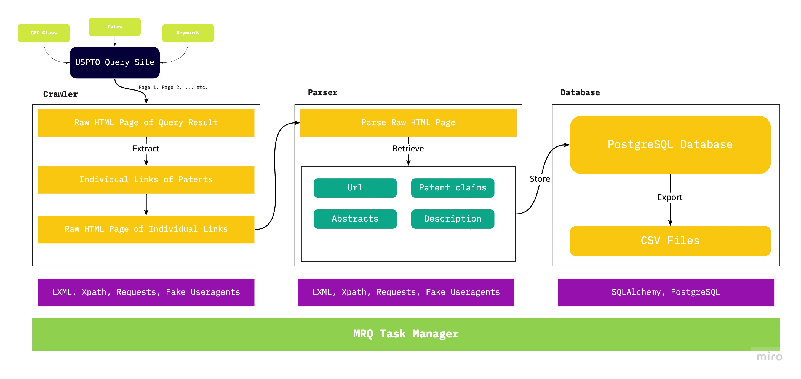
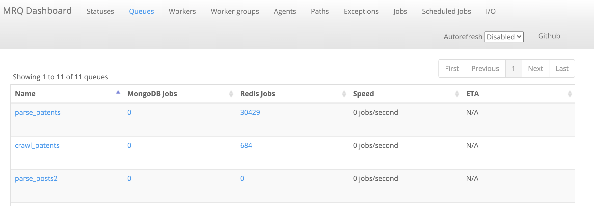

# Patent Claim and Abstract Generation: Web Crawler
## Description
I collected data from the United States Patent and Trademark Office (USPTO) Patent Full-Text and Image Database (PatFT) which contains all of the patents ever filed and granted in the US since 1976 (for text data). Patents in the database are classified using the Cooperative Patent Classification (CPC), a classification system jointly developed by the USPTO and the European Patent Office (EPO) to improve the ease of patent research. Using the classification, patents are grouped by their subjects matter.

### Libaries Used
To build the crawler, I relied on the Python library Requests to retrieve raw HTML files from the query results of the USPTO patent database. By accessing the query page and inputting a query string including fields such as the CPC class and dates, the database returns a list of pages that includes the search results. Each page includes links to patent documents that contain patent text information in the form of an HTML page. Using Requests and other crawler libraries, I am able to access the pages and parse through the raw HTML to retrieve the text data I need. A parser task is then required to parse through the text data before the data is saved in a database. 

The jobs (the crawler, the parser, and saving to the database) are assigned and scheduled using MRQ, a distributed task queue for Python built on top of mongo, Redis, and Gevent. Instead of writing a single script that does all of the tasks together and running the script on a machine like a traditional crawler or relying on frameworks like Scrapy, I find using MRQ to automate my job scheduling superior in two respects. Compared to a simple script, MRQ abstracts the tasks (with a Task class), which allows users to create their own tasks and abstract them instead of building and calling functions over and over again. Abstractions also allow readers or users of the crawler to better understand how the code comes together. Moreover, as MRQ is not a tool that serves specifically for web crawlers, it offers a much greater degree of flexibility than frameworks such as Scrapy. I can introduce methods that modify the text data within MRQ (in the parser task) before storing the data, rather than having to save all of the raw text in the database and processing it afterward.

For specifics about MRQ, please visit their github repo [here](https://github.com/pricingassistant/mrq) or their documentation [here](https://mrq.readthedocs.io/en/latest/)

The Pipeline of the current crawler is as follows:


### Set up
Make sure redis and mongod is up and running
```
redis-server &
```
```
cd /usr/local/mongodb/bin
sudo ./mongod
```

Beware of caches!! (clear pycaches)


Once everything is set up, you can open up the mrq dashboard:
```
mrq-dashboard &
```
Where you can observe queues and workers on http://0.0.0.0:5555/ (by default)

Run:
```
mrq-worker &
```
To set up default worker, who can assist in canceling unwanted jobs or requeue manually on the dashboard

After everything is set up, you will be able to run mrq commands:
```
mrq-run --queue task *params
```
to enqueue tasks

```
mrq-worker queue
```
to start worker 


Check working workers:
```
ps -ef|grep mrq
```

For the Patent Crawler, we need to start the workers in the specific tasks, this is available in the `command.sh` file:
```
mrq-worker taskexecutor --greenlet 1 & mrq-worker crawl_patents --greenlet 3 & mrq-worker parse_patents --greenlet 5 &
```
`--greenlet` specify the number of workers, the more we have the more are working on the specific task queue

Once this runs, just sit back an let the crawler do its magic. You can also monitor the progress in the mrq dashboard.

The dashboard looks like this:


To specify the type of patents you want to crawl, you need to specify the query string to the USPTO database. This is located in the `task_exectutor.py`. For example, if I wanted to crawl the latest patents in CPC class H01L:
```
def run(self, params):
    '''
    Enqueue spider jobs
    '''
    # 我們在這裡開始分發任務
    # assign the CPC classification here
    # classification = "H01L" 
    # As specified in the "Methods," we will be crawling data from the H01L CPC class
    start_pages = 1
    end_pages = 1000  # get first 1000 pages of patents
    for page in range(start_pages, end_pages+1):
        # this is the query string that helps us query the patents 
        # page allows us to go to each page of the query results and crawl those results
        url = f"http://patft.uspto.gov/netacgi/nph-Parser?Sect1=PTO2&Sect2=HITOFF&u=%2Fnetahtml%2FPTO%2Fsearch-adv.htm&r=0&f=S&l=50&d=PTXT&OS=CPCL%2FH01L&RS=CPCL%2FH01L&Query=CPCL%2FH01L&TD=439972&Srch1=H01L.CPCL.&NextList{page}=Next+50+Hits"
        self.exec_push_work(url)
```
Here, the query string becomes:
```
http://patft.uspto.gov/netacgi/nph-Parser?Sect1=PTO2&Sect2=HITOFF&u=%2Fnetahtml%2FPTO%2Fsearch-adv.htm&r=0&f=S&l=50&d=PTXT&OS=CPCL%2FH01L&RS=CPCL%2FH01L&Query=CPCL%2FH01L&TD=439972&Srch1=H01L.CPCL.&NextList{page}=Next+50+Hits
```
Which allows us to query H01L. We can modify the query string to crawl other types of data. Another way of finding the right query string is to go to the USPTO database, enter the queries and copy the url that results from it. The last part of the string (`&NextList{page}=Next+50+Hits`) allows us to query multiple pages. The for loop allows us to crawl pages after the first page and get as many patents as we need.
